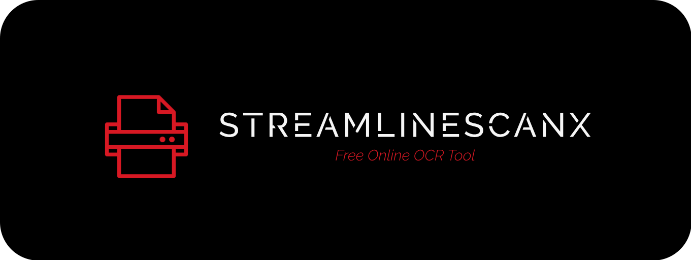
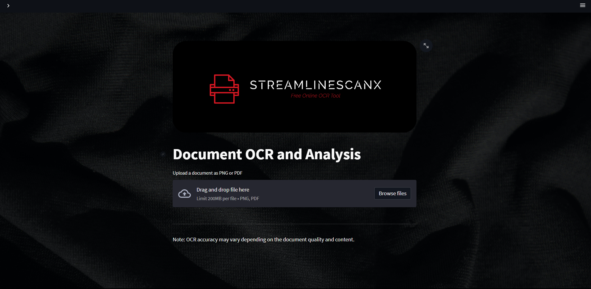

# StreamlineScanX-ArizonaHacks✨

StreamlineScanX is a powerful document OCR and analysis tool that simplifies document processing, allowing you to upload PNG images or PDF files to extract text, detect tables, and gain valuable insights with ease. 📚💼


## Features ✅

- **Image OCR**📷: Upload a PNG image and extract text using OCR.
- **PDF Processing**📄: Upload a PDF file and extract text from each page or the complete text of the PDF.
- **Table Detection**📊: Detect tables in the uploaded image and highlight them.
- **Visualize Results**📈: View the uploaded image with bounding boxes or individual pages with extracted text.
- **Download Extracted Text** ⬇️: Download the extracted text as a TXT file.
- **User-Friendly Interface** 🌟: StreamlineScanX provides an intuitive and easy-to-use interface for seamless document processing.

**WebApp Screenshot** 🖥️



## Tutorial Video 📽️

**Click** this [Link](https://youtu.be/WRZnica3H5k) to watch the tutorial video of StreamlineScanX. 🎬

## Usage 🚀

To run the StreamlineScanX application, follow these steps:

1. Clone the repository: `git clone https://github.com/arpitsinghgautam/StreamlineScanX-ArizonaHacks.git`
2. Install the required dependencies: `pip install -r requirements.txt`
3. Run the application: `streamlit run streamlit_app.py`
4. Access the application in your web browser at `http://localhost:8501`

## Dependencies 📦

The following dependencies are required to run StreamlineScanX:

- streamlit
- torch
- transformers
- opencv-python-headless==4.5.3.56
- numpy
- pandas
- pillow
- pytesseract
- pdf2image

You can install the required dependencies using the provided `requirements.txt` file:

```shell
pip install -r requirements.txt
```

## Acknowledgements 🙌

StreamlineScanX was created as a project for submission in ArizonaHacks 2023.